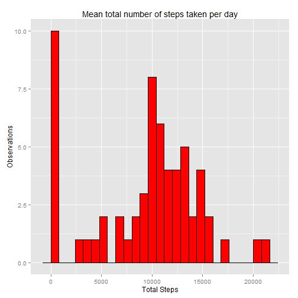
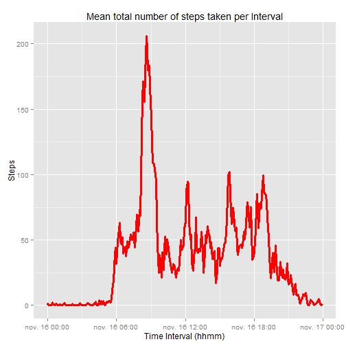
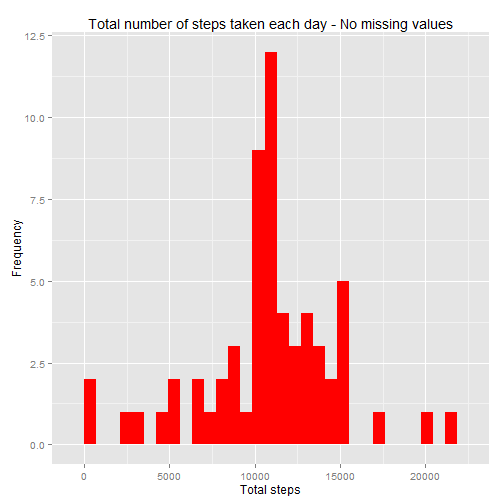

#Peer Assessment Project 1#
##Loading and preprocessing the data

```r
##The first step will be a load of study data
##from the file "activity.csv" 
data <- read.csv("activity.csv")
working_data<-data
```


```r
##The second step is to add the data by day discarding data
##without observation "NA"
ag_data <-  aggregate(working_data[, 'steps'], by=list(working_data$date), 
                      sum, na.rm = TRUE)
colnames(ag_data) <- c('Date', 'Steps')
## Observe the data generated
head (ag_data)
```

```
##         Date Steps
## 1 2012-10-01     0
## 2 2012-10-02   126
## 3 2012-10-03 11352
## 4 2012-10-04 12116
## 5 2012-10-05 13294
## 6 2012-10-06 15420
```
## What is mean total number of steps taken per day?

```r
library(ggplot2)
graph = ggplot(ag_data, aes(x = Steps)) + 
      geom_histogram(binwidth = 800, color="black", fill="red") + 
      labs(x = "Total Steps", y = "Observations", 
           title = "Mean total number of steps taken per day")
graph
```

 


```r
## Calculate and report the mean and median total number of steps taken per day
mean(ag_data$Steps)
```

```
## [1] 9354.23
```

```r
median(ag_data$Steps)
```

```
## [1] 10395
```

## What is the average daily activity pattern?

```r
## Formating date and time variables
time <- formatC(working_data$interval/100, 2, format = "f")
working_data$datetime <- as.POSIXct(paste(working_data$date, time), format = "%Y-%m-%d %H.%M",tz = "GMT")
working_data$time <- format(working_data$datetime, format = "%H:%M:%S")
working_data$time <- as.POSIXct(working_data$time, format = "%H:%M:%S")
working_serie <- with(working_data, aggregate(steps, by = list(time), mean, 
                                            na.rm = T))
names(working_serie) = c("Interval", "MeanSteps")
## Look at the first few rows of data
head(working_serie)
```

```
##              Interval MeanSteps
## 1 2014-11-16 00:00:00 1.7169811
## 2 2014-11-16 00:05:00 0.3396226
## 3 2014-11-16 00:10:00 0.1320755
## 4 2014-11-16 00:15:00 0.1509434
## 5 2014-11-16 00:20:00 0.0754717
## 6 2014-11-16 00:25:00 2.0943396
```

```r
## Use ggplot to build and format graph
working_graph <- ggplot(working_serie, aes(x = Interval, y = MeanSteps)) + 
      geom_line(color = "red", size = 1.25) +  
      labs(x = "Time Interval (hhmm)", y = "Steps",
      title = "Mean total number of steps taken per Interval")
      #+ scale_x_datetime(labels = date_format(format = "%H:%M"))
working_graph
```

 

```r
## Which 5-minute interval, on average across all the days in the dataset, contains the maximum number of steps?
max <- which.max(working_serie$MeanSteps)
format(working_serie[max, "Interval"], format = "%H:%M")
```

```
## [1] "08:35"
```

## Imputing missing values

```r
##Calculate and report the total number of missing values in the dataset (i.e. the total number of rows with NAs)
nrow(working_data[is.na(data[,1]) == TRUE,])
```

```
## [1] 2304
```


```r
##Devise a strategy for filling in all of the missing values in the dataset.
suppressWarnings(library(Hmisc))
working_fill <- working_data
working_fill$steps <- with(working_fill, impute(steps, mean))
## Look at the first few rows with no missing values
head(working_fill)
```

```
##     steps       date interval            datetime                time
## 1 37.3826 2012-10-01        0 2012-10-01 00:00:00 2014-11-16 00:00:00
## 2 37.3826 2012-10-01        5 2012-10-01 00:05:00 2014-11-16 00:05:00
## 3 37.3826 2012-10-01       10 2012-10-01 00:10:00 2014-11-16 00:10:00
## 4 37.3826 2012-10-01       15 2012-10-01 00:15:00 2014-11-16 00:15:00
## 5 37.3826 2012-10-01       20 2012-10-01 00:20:00 2014-11-16 00:20:00
## 6 37.3826 2012-10-01       25 2012-10-01 00:25:00 2014-11-16 00:25:00
```

```r
##Create a new dataset that is equal to the original dataset but 
##with the missing data filled in
ag_data_fill <-  aggregate(working_fill[, 'steps'], by=list(working_fill$date), 
                      sum, na.rm = TRUE)
colnames(ag_data_fill) <- c('Date', 'Steps')
head(ag_data_fill)
```

```
##         Date    Steps
## 1 2012-10-01 10766.19
## 2 2012-10-02   126.00
## 3 2012-10-03 11352.00
## 4 2012-10-04 12116.00
## 5 2012-10-05 13294.00
## 6 2012-10-06 15420.00
```

```r
##Make a histogram of the total number of steps taken each day
qplot(ag_data_fill$Steps, geom = "histogram", fill=I("red"), main="Total number of steps taken each day - No missing values",xlab = "Total steps", ylab = "Frequency")
```

 

```r
#Calculate and report the mean and median total number of steps taken per day
working_temp <- tapply(working_fill$steps, working_fill$date, sum)
mean(working_temp)
```

```
## [1] 10766.19
```

```r
median(working_temp)
```

```
## [1] 10766.19
```
## Are there differences in activity patterns between weekdays and weekends?
No time for more.
I´m sorry.
